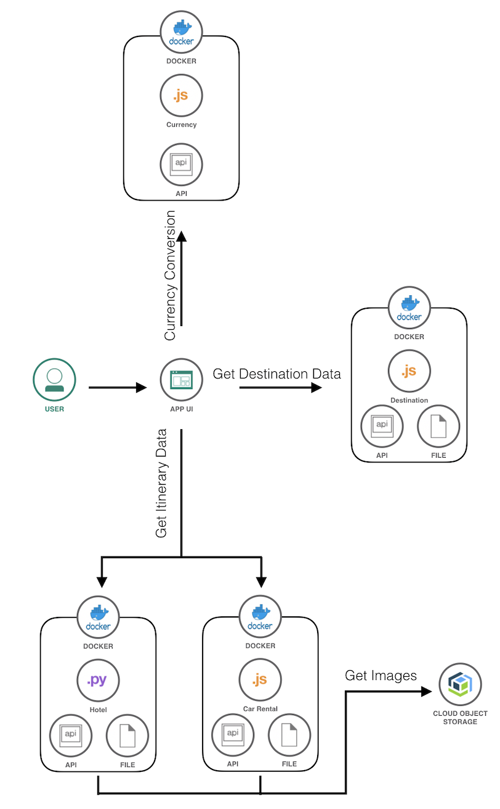
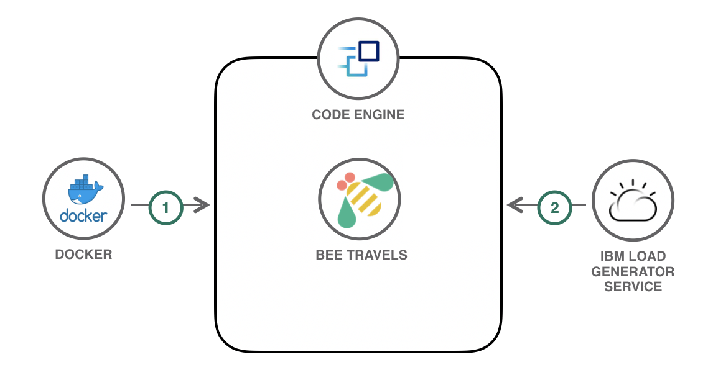
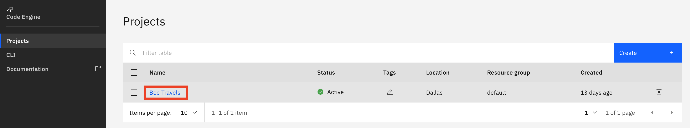
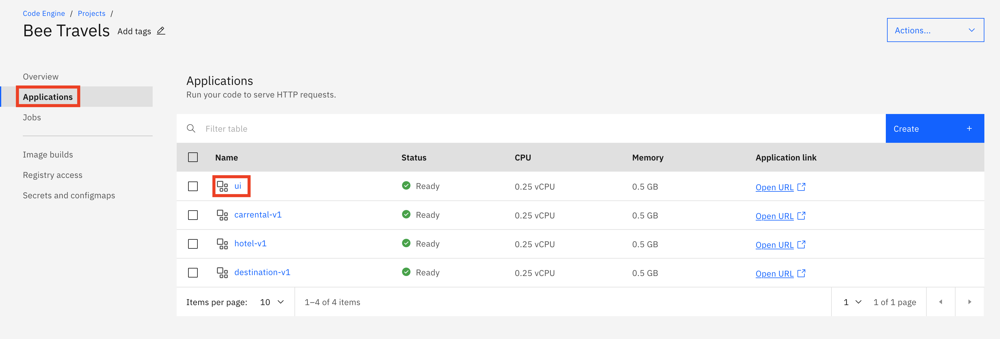
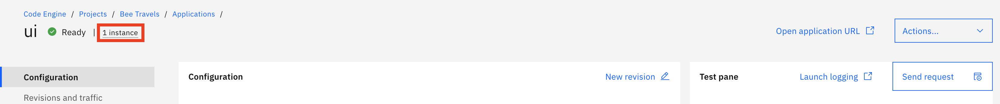
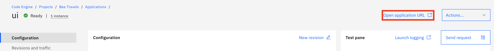

# Deploy a Microservices App to IBM Cloud Code Engine

This code pattern introduces you to [Code Engine](https://www.ibm.com/cloud/code-engine) and shows how to deploy a polyglot microservice travel application to the managed serverless platform. The travel application used in this code pattern is a part of the [Bee Travels](https://bee-travels.github.io/) project that focuses on some of the first version services of the application. The services included in this code pattern are:

* Destination v1 (Node.js)
* Car Rental v1 (Node.js)
* Hotel v1 (Python)
* UI (Node.js/React)

Below is the architecture diagram for v1 of the Bee Travels application:



[IBM Cloud Code Engine](https://cloud.ibm.com/docs/codeengine?topic=codeengine-getting-started) is a managed serverless platform that can run both applications that serve HTTP requests which includes web applications or microservices as well as run batch jobs that run once in order to complete a task. These workloads are run within the same [Kubernetes](https://kubernetes.io/) infrastructure and take advantage of open source technology including [Knative](https://knative.dev/) and [Istio](https://istio.io/). Knative is used to manage the serverless aspect of hosting applications, which includes auto-scaling of them based on incoming load - including down to zero when they are idle. Istio is used for routing and traffic management of applications. In addition, Code Engine is integrated with [LogDNA](https://www.logdna.com/) to allow for logging of your applications. As a developer, the benefit to using Code Engine is that this Kubernetes infrastructure and cluster complexity is invisible to you. No Kubernetes training is needed and developers can just focus on their code.

# Architecture



1. The Code Engine build feature clones the Github repo and builds the container images for the different Bee Travels microservices in the repo based on the provided Dockerfiles.
2. The newly built container images get pushed to repos on the provided image registry which in this case is Dockerhub.
3. Code Engine applications are created for the Bee Travels microservices from the newly built container images on Dockerhub.
4. The IBM load generation tool generates traffic to the Bee Travels application running in Code Engine. The auto-scaling component of Code Engine adjusts the number of running instances of the application based on the amount of incoming traffic.

# Steps

1. [Prerequisites](#1-prerequisites)
2. [Clone the repo](#2-clone-the-repo)
3. [Build and Deploy to Code Engine](#3-build-and-deploy-to-code-engine)
4. [Generate Traffic](#4-generate-traffic)

## 1. Prerequisites

To follow the steps in this code pattern, you need the following:

* [IBM Cloud account](https://cloud.ibm.com/registration)
* [IBM Cloud CLI](https://cloud.ibm.com/docs/cli?topic=cli-getting-started)
* [Dockerhub account](https://hub.docker.com/)

## 2. Clone the repo

Clone the `code-engine-microservices` repo locally. In a terminal window, run:

```
$ git clone https://github.com/IBM/code-engine-microservices
$ cd code-engine-microservices
```

## 3. Build and Deploy to Code Engine

1. From a terminal window, login to your IBM Cloud account using the CLI command: `ibmcloud login`

2. Verify you are targeting the correct region, account, resource group, org and space by running `ibmcloud target`. To set any of these to new targets, add `-h` to the command to view the necessary flags for changing the targets.

3. Install the IBM Cloud Code Engine plug-in for the IBM Cloud CLI by running: `ibmcloud plugin install code-engine`

4. Verify the plug-in is installed by running `ibmcloud plugin list` and seeing `code-engine/ce` in the list of plug-ins.

5. Open [build-and-deploy.sh](build-and-deploy.sh) and let's look at lines 9-31 of the script:

```
ibmcloud ce project create -n "Bee Travels"
```

Line 9 creates a Code Engine project named `Bee Travels`. A project is a grouping of Code Engine applications and jobs. Creating a project allows for network isolation, sharing of resources (ex. secrets), and grouping together applications and jobs that are related.

```
id=$(ibmcloud ce proj current | grep "Kubectl Context:" | awk '{print $3}')
``` 

Line 10 is responsible for getting the unique ID of the project. Each project has an associated unique ID that is used as part of the endpoints defined for the apps within that project. This is needed for getting the URLs of applications for internal traffic to the project which will be shown later.

```
ibmcloud ce registry create -n "${DOCKERHUB_NAME}-dockerhub" -u $DOCKERHUB_NAME -p $DOCKERHUB_PASS -s https://index.docker.io/v1/
```

Line 11 creates an image registry access secret. For the purpose of this code pattern, the registry we will be working with is Dockerhub.
* `-n` names the image registry access secret
* `-u` specifies the username to access the registry server
* `-p` specifies the password to access the registry server
* `-s` is the URL of the registry server

```
ibmcloud ce build create -n destination-v1-build -i ${DOCKERHUB_NAME}/destination-v1:latest --src https://github.com/IBM/code-engine-microservices --rs "${DOCKERHUB_NAME}-dockerhub" --cdr src/services/destination-v1 --sz small
```

Line 14 creates a build configuration that will turn the source code from Github into runnable container images for applications in Code Engine. Lines 19, 24, and 29 of the shell script are similar in which they specify the build configurations for the hotel, car rental, and ui microservices.
* `-n` names the build
* `-i` points to where the built container image will be pushed to
* `--src` points to the Github repo where the source code is
* `--rs` the name of the image registry access secret to be used
* `--cdr` specifies the directory in the Github repo where the Dockerfile to be used is
* `--sz` specifies the size for the build which determines the amount of resources used. This is optional and the default value is `medium`.

```
ibmcloud ce buildrun submit -b destination-v1-build -n destination-v1-buildrun -w
```

Line 15 starts and runs the build configuration that was created on the previous line. Lines 20, 25, and 30 of the shell script are similar in which the start and run the build configurations for the hotel, car rental, and ui microservices.
* `-b` the name of the build configuration to run the build
* `-n` names the build run
* `-w` waits for the build run to complete before moving on to the next line of the shell script. This is optional.

```
ibmcloud ce app create -n destination-v1 -i ${DOCKERHUB_NAME}/destination-v1:latest --cl -p 9001 --min 1 --cpu 0.25 -m 0.5G -e LOG_LEVEL=info
``` 

Line 16 creates an application in our Code Engine project for our destination microservice. An application in Code Engine runs your code to serve HTTP requests with the number of running instances automatically scaled up or down. Lines 21 and 26 of the shell script for creating the hotel and car rental microservices are similar, because all three services are backend services of the Bee Travels application and do not need external traffic.
* `-n` names the application
* `-i` points to the container image reference
* `--cl` specifies that the application will only have a private endpoint and no exposure to external traffic. This can be used by backend services that do not need exposure to outside traffic and only communicate between other services of an application. By not exposing applications that don't need external exposure, this may also save potential security risks
* `-p` specifies the listening port. This only needs to be set when the port used by the application is not the default 8080
* `--min` specifies the minimum number of instances of the application running. The default value is 0
* `--cpu` specifies the amount of CPU resources for each instance
* `-m` specifies the amount of memory resources for each instance
* `-e` is used for each environment variable used by the application

```
ibmcloud ce app create -n ui -i ${DOCKERHUB_NAME}/ui:latest -p 9000 --min 1 --cpu 0.25 -m 0.5G -e NODE_ENV=production -e DESTINATION_URL=http://destination-v1.${id}.svc.cluster.local -e HOTEL_URL=http://hotel-v1.${id}.svc.cluster.local -e CAR_URL=http://carrental-v1.${id}.svc.cluster.local
```

Line 31 creates an application in our Code Engine project for the UI microservice. This is the microservice that users will interact with and therefore requires external traffic. Notice how this command does not have the `--cl` flag. The removal of this flag allows for external traffic and a URL to be generated for the application. The URL is secured automatically. In addition, some of the environment variables for this microservice specify the URLs to communicate with the other microservices. Since the other microservices use internal traffic, Code Engine uses the format `<APP_NAME>.<ID>.svc.cluster.local` as the entrypoint to an application. `APP_NAME` for each application is already defined in each `ibmcloud ce app create` command and `ID` was gotten from one of the previous commands in this script.

Notice how the minimum number of instances for each application of Bee Travels is set to 1: `--min 1`. This is due to the fact that we want Bee Travels to always be readily available for traffic without delay and needing an instance to be initialized via cold start. Use cases for using the default value of 0 for the mimimum number of instances for each application include:

* Application does not receive a high volume of traffic consistently
* Cold start delays are not a concern
* Interested in conserving resources and costs

For more details and documentation on the Code Engine CLI, go [here](https://cloud.ibm.com/docs/codeengine?topic=codeengine-cli).

6. From a terminal window, run the `build-and-deploy.sh` script to deploy the Bee Travels application to IBM Cloud Code Engine. Provide your Dockerhub username and password when prompted to from the script.

```
$ cd code-engine-microservices
$ ./build-and-deploy.sh
Dockerhub Username:
Dockerhub Password:
```

7. When the script finishes, you will notice a URL in the terminal window that has the following format: `https://ui.<NAMESPACE>.<REGION>.codeengine.appdomain.cloud` This is the entrypoint to the Bee Travels application on Code Engine. Open this URL in a browser to view and interact with the Bee Travels application.

## 4. Generate Traffic

Since Code Engine is a fully managed, serverless platform, the number of instances running for each application will auto-scale depending on the maximum number of concurrent requests per instance of incoming traffic to each application. In this part of the code pattern, we are going to generate traffic to the `UI` application of Bee Travels and watch the number of running instances of the application auto-scale based on the changing traffic. To do this, run the following steps:

1. View the Bee Travels project in the UI of IBM Cloud by going to `https://cloud.ibm.com/codeengine/projects` and choose the `Bee Travels` project.



2. From the `Bee Travels` project page, select `Application` and the click on the `ui` application.



3. Notice in the top left corner how next to the name of the application, it shows that the application is in the `ready` state and has `1 instance` currently running. There is only 1 instance running, because that is what we specified as the minimum number of instances of the application running. Since we never specified the maximum number of instances that can be used for this application by using the `--max` flag, it defaults to a maximum of 10.



4. Open up a second window of your web browser side by side with the first window and go to [https://load.fun.cloud.ibm.com](https://load.fun.cloud.ibm.com) to access the IBM load generator tool. For the URL to enter, copy/paste the `https://ui.<NAMESPACE>.<REGION>.codeengine.appdomain.cloud` URL that is used to access the Bee Travels application. You can also retrieve this URL from your first web browser URL by copying the URL from the `Open Application URL` button.



5. Press the `Generate Load` button on the load generation tool and watch how the number of instances of the `ui` application auto-scale up to 10 while traffic is being generated and back down to 1 once the traffic stops.

# Congratulations

Without having any knowledge or interaction with the underlying infrastructure of Code Engine, you have successfully completed the following:

* Built container images for Node.js and Python microservices
* Created/Deployed a workload to Code Engine consisting of public and private microservices
* Secured an external application
* Independent auto-scaling on a per-microservice basis

All of this was completed by only specifying desired runtime semantics (ex. whether to scale or not) and Code Engine took care of the rest.

# License

This code pattern is licensed under the Apache License, Version 2. Separate third-party code objects invoked within this code pattern are licensed by their respective providers pursuant to their own separate licenses. Contributions are subject to the [Developer Certificate of Origin, Version 1.1](https://developercertificate.org/) and the [Apache License, Version 2](https://www.apache.org/licenses/LICENSE-2.0.txt).

[Apache License FAQ](https://www.apache.org/foundation/license-faq.html#WhatDoesItMEAN)