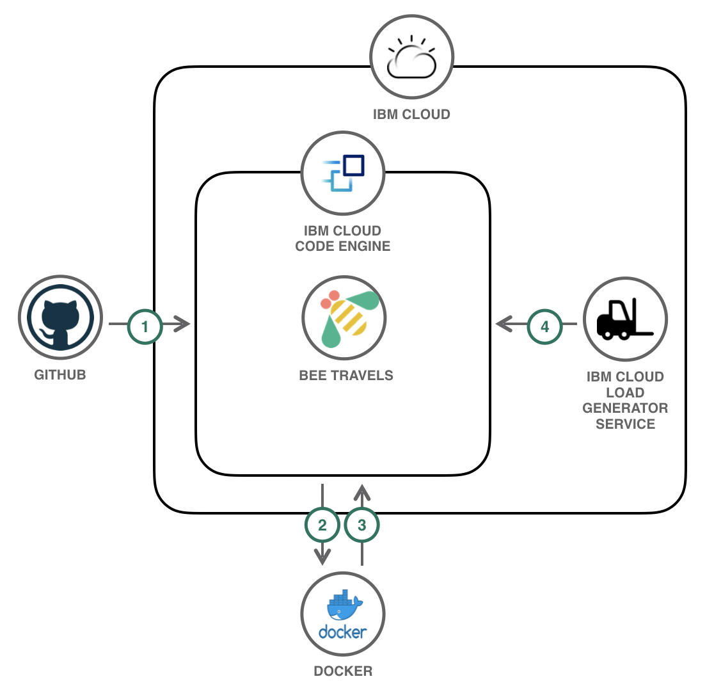

# Deploy a Microservices App to IBM Cloud Code Engine

This code pattern introduces you to [Code Engine](https://www.ibm.com/cloud/code-engine) and shows how to deploy a polyglot microservice travel application to the managed serverless platform. The travel application used in this code pattern is a part of the [Bee Travels](https://bee-travels.github.io/) project that focuses on some of the first version services of the application. The services included in this code pattern are:

* Destination v1 (Node.js)
* Car Rental v1 (Node.js)
* Hotel v1 (Python)
* Currency Exchange (Node.js)
* UI (Node.js/React)

[IBM Cloud Code Engine](https://cloud.ibm.com/docs/codeengine?topic=codeengine-getting-started) is a managed serverless platform that can run both applications that serve HTTP requests which includes web applications or microservices as well as run batch jobs that run once in order to complete a task. These workloads are built within the same [Kubernetes](https://kubernetes.io/) infrastructure and take advantage of open source technology including [Knative](https://knative.dev/) and [Istio](https://istio.io/). Knative allows for Code Engine to run serverless and used to autoscale applications. Istio is used for routing and traffic management of applications. In addition, Code Engine is integrated with [LogDNA](https://www.logdna.com/) to allow for logging of your applications.

# Architecture



1. The provided scripts build the Docker images of the Bee Travels microservices and deploy them to Code Engine.
2. The IBM load generation tool generates traffic to the Bee Travels application running in Code Engine. The auto-scaling component of Code Engine adjusts the number of running instances of the application based on the amount of incoming traffic.

# Steps

1. [Prerequisites](#1-prerequisites)
2. [Fork the repo](#2-fork-the-repo)
3. [Build Docker Images](#3-build-docker-images)
4. [Deploy to Code Engine](#4-deploy-to-code-engine)
5. [Generate Traffic](#5-generate-traffic)

## 1. Prerequisites

To follow the steps in this code pattern, you need the following:

* [IBM Cloud account](https://cloud.ibm.com/registration)
* [IBM Cloud CLI](https://cloud.ibm.com/docs/cli?topic=cli-getting-started)
* [Docker](https://www.docker.com/products/docker-desktop)
* [NodeJS](https://nodejs.org/en/download/)
* [NPM](https://www.npmjs.com/get-npm)
* [Yarn](https://classic.yarnpkg.com/en/docs/install)

## 2. Fork the repo

1. Scroll to the top of this repo and press the **Fork** button.

2. Select the account from the list that you would like to fork the repo to.

## 3. Build Docker Images

1. From a terminal window, run the `build-docker.sh` script to build the Bee Travels application and push the newly created Docker images to your Docker Hub account.
> NOTE: This step can take a few minutes

```
cd code-engine-microservices
./build-docker.sh -d <DOCKERHUB_USERNAME>
```

## 4. Deploy to Code Engine

1. From a terminal window, log in to your IBM Cloud account using the CLI command: `ibmcloud login --sso`

2. Verify you are targeting the correct region, account, resource group, org and space by running `ibmcloud target`. To set any of these to new targets, add `-h` to the command to view the necessary flags for changing the targets.

3. Install the IBM Cloud Code Engine plug-in for the IBM Cloud CLI by running: `ibmcloud plugin install code-engine`

4. Verify the plug-in is installed by running `ibmcloud plugin list` and seeing `code-engine/ce` in the list of plug-ins.

5. Open [deploy-code-engine.sh](deploy-code-engine.sh) and let's look at lines 15-22 of the script:

* `ibmcloud ce project create -n "Bee Travels"` creates a Code Engine project named `Bee Travels`. A project is a grouping of Code Engine applications and jobs.

* `ibmcloud ce project select -n "Bee Travels"` selects the project `Bee Travels` as the current project that will be worked with.

* `ns=$(ibmcloud ce proj current | grep "Kubectl Context:" | awk '{print $3}')` is responsible for getting the name of the namespace used by the project. This is needed for getting the URLs of applications for internal traffic to the project which will be shown later.

*  `ibmcloud ce app create -n destination-v1 -i ${DOCKERHUB_NAME}/destination-v1:latest --cl -p 9001 --min 1 --cpu 0.25 -m 0.5G -e HOST_IP=destination-v1 -e LOG_LEVEL=info -e SCHEME=http` creates an application in our Code Engine project for our destination microservice. An application in Code Engine runs your code to serve HTTP requests with the number of running instances automatically scaled up or down. The next three lines of the shell script for creating the hotel, car rental, and currency exchange microservices are similar, because all four services are backend services of the Bee Travels application and do not need external traffic.
	* `-n` names the application
	* `-i` points to the Docker image reference
	* `--cl` specifies that the application will only have a private endpoint and no exposure to external traffic
	* `-p` specifies the listening port
	* `--min` specifies the minimum number of instances of the application running
	* `--cpu` specifies the amount of CPU resources for each instance
	* `-m` specifies the amount of memory resources for each instance
	* `-e` is used for each environment variable used by the application

* `ibmcloud ce app create -n ui -i ${DOCKERHUB_NAME}/ui:latest -p 9000 --min 1 --cpu 0.25 -m 0.5G -e NODE_ENV=production -e DESTINATION_URL=http://destination-v1.${ns}.svc.cluster.local -e HOTEL_URL=http://hotel-v1.${ns}.svc.cluster.local -e CAR_URL=http://carrental-v1.${ns}.svc.cluster.local` creates an application in our Code Engine project for the UI microservice. This is the microservice that users will interact with and therefore requires external traffic. Notice how this command does not have the `--cl` flag. The removal of this flag allows for external traffic and a URL to be generated for the application. In addition, some of the environment variables for this microservice specify the URLs to communicate with the other microservices. Since the other microservices use internal traffic, Code Engine uses the format `<APP_NAME>.<NAMESPACE>.svc.cluster.local` as the entrypoint to an application. `APP_NAME` for each application is already defined in each `ibmcloud ce app create` command and `NAMESPACE` was gotten from one of the previous commands in this script.

For more details and documentation on the Code Engine CLI, go [here](https://cloud.ibm.com/docs/codeengine?topic=codeengine-cli).

6. Run `./deploy-code-engine.sh` to deploy the Bee Travels application to IBM Cloud Code Engine.

```
cd code-engine-microservices
./deploy-code-engine.sh -d <DOCKERHUB_USERNAME>
```

7. When the script finishes, you will notice a URL in the terminal window that has the following format: `https://ui.<NAMESPACE>.<REGION>.codeengine.appdomain.cloud` This is the entrypoint to the Bee Travels application on Code Engine. Open this URL in a browser to view and interact with the Bee Travels application.

## 5. Generate Traffic

Since Code Engine is a fully managed, serverless platform, the number of instances running for each application will auto-scale depending on the maximum number of concurrent requests per instance of incoming traffic to each application. In this part of the code pattern, we are going to generate traffic to the `UI` application of Bee Travels and watch the auto-scaling with the number of running instances of our application change with traffic. To do this, run the following steps:

1. View the Bee Travels project in the UI of IBM Cloud by going to `https://cloud.ibm.com/codeengine/projects` and choose the `Bee Travels` project.


2. From the `Bee Travels` project page, select `Application` and the click on the `ui` application.


3. Notice in the top left corner how next to the name of the application, it shows that the application is in the `ready` state and has `1 instance` currently running. There is only 1 instance running, because that is what we specified as the minimum number of instances of the application running. Since we never specified the maximum number of instances that can be used for this application by using the `--max` flag, it defaults to a maximum of 10.


4. Open up a second window of your web browser side by side with the first window and go to `https://load.fun.cloud.ibm.com` For the URL to enter, copy/paste the `https://ui.<NAMESPACE>.<REGION>.codeengine.appdomain.cloud` URL that is used to access the Bee Travels application. You can also retrieve this URL from your first web browser URL by copying the URL from the `Open Application URL` button.


5. Press the `Generate Load` button on the load generation tool and watch how the number of instances of the `ui` application auto-scale up to 10 while traffic is being generated and back down to 1 once the traffic stops.

# License

This code pattern is licensed under the Apache License, Version 2. Separate third-party code objects invoked within this code pattern are licensed by their respective providers pursuant to their own separate licenses. Contributions are subject to the [Developer Certificate of Origin, Version 1.1](https://developercertificate.org/) and the [Apache License, Version 2](https://www.apache.org/licenses/LICENSE-2.0.txt).

[Apache License FAQ](https://www.apache.org/foundation/license-faq.html#WhatDoesItMEAN)